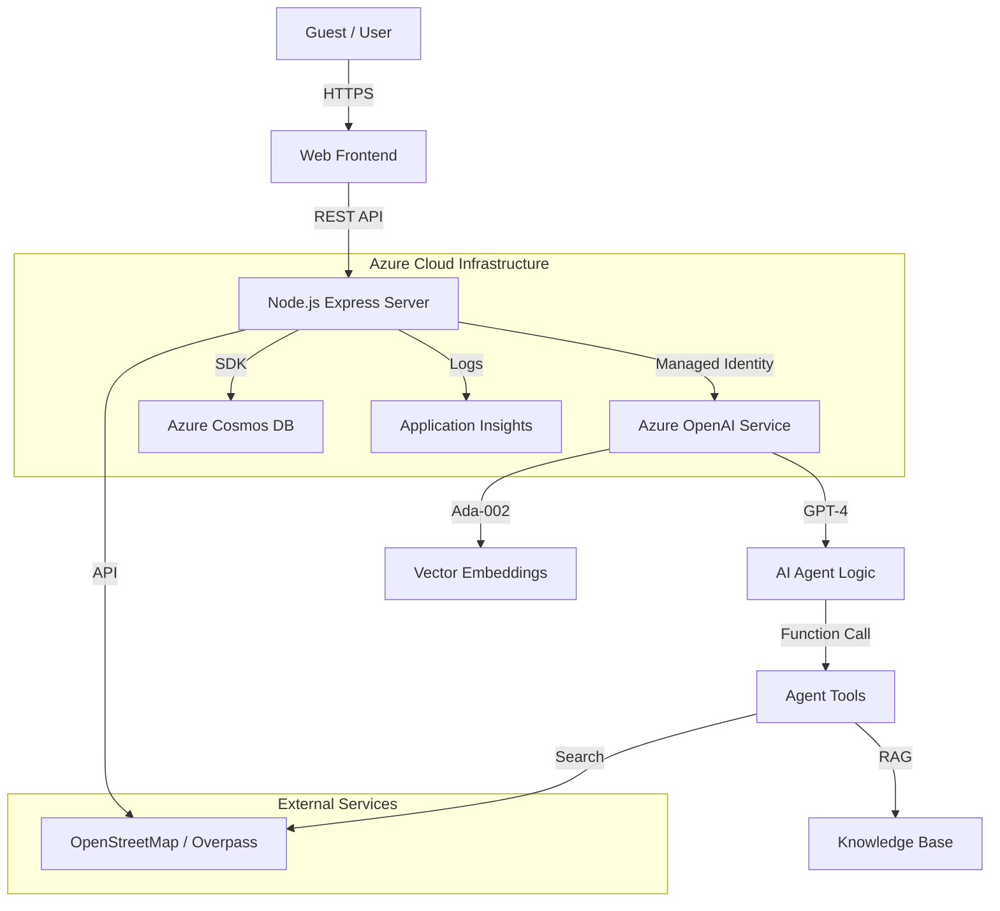

# System Architecture & Design

## 🏗️ High-Level Architecture

The AI Concierge system is built on a modern, cloud-native architecture leveraging Azure's PaaS offerings for scalability, security, and performance.

## 🛠️ Technology Stack & Justification

| Component | Technology | Justification for Digital Transformation |
|-----------|------------|------------------------------------------|
| **AI Engine** | **Azure OpenAI (GPT-4)** | Enterprise-grade security, compliance, and superior reasoning capabilities compared to open-source models. Essential for handling complex guest queries accurately. |
| **Backend** | **Node.js & Express** | Non-blocking I/O is ideal for handling multiple concurrent guest requests. Large ecosystem allows for rapid feature development. |
| **Database** | **Azure Cosmos DB** | Global distribution, low latency, and schema-less flexibility perfect for storing unstructured guest profiles and ticket data. |
| **Search** | **Vector Search (RAG)** | Uses Cosine Similarity with Embeddings to provide "grounded" answers from the hotel's specific policy documents, reducing hallucinations. |
| **Frontend** | **HTML5/CSS3/JS** | Lightweight, responsive design ensures accessibility across all guest devices (mobile, tablet, desktop) without requiring app installation. |
| **Maps** | **OpenStreetMap** | Open-source, cost-effective alternative to Google Maps for location services, aligning with budget optimization goals. |

## 🔒 Security & Compliance

- **Managed Identity**: Zero-trust security model. No API keys are stored in the codebase; the application authenticates to Azure services using its Azure AD identity.
- **Data Privacy**: Guest data is processed in-memory or stored in secure Cosmos DB instances. No PII is sent to external non-Azure services.
- **Content Safety**: Azure OpenAI content filters prevent the bot from generating inappropriate or harmful responses.

## ⚡ Non-Functional Requirements (NFRs)

### 1. Scalability
- **Horizontal Scaling**: The stateless Node.js architecture allows the application to scale out across multiple Azure App Service instances during peak check-in/out times.
- **Database**: Cosmos DB automatically scales throughput (RU/s) based on demand.

### 2. Performance
- **Response Time**: Target < 2 seconds for standard queries.
- **Caching**: Frequent location searches are cached to reduce API latency.
- **Embeddings**: Vector embeddings are pre-calculated on startup to speed up RAG retrieval.

### 3. Reliability
- **Fallback Mechanisms**: If Azure AI is unavailable, the system degrades gracefully to rule-based matching (Fuse.js).
- **Health Checks**: Automated endpoints (`/api/health`) for monitoring system status.

### 4. Maintainability
- **Modular Code**: Separation of concerns between API routes, AI logic, and data handling.
- **Configuration**: All environment-specific variables are externalized in `.env` files.
